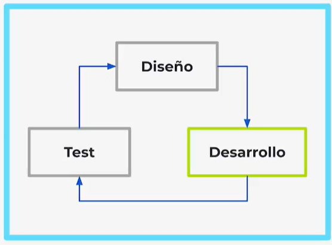
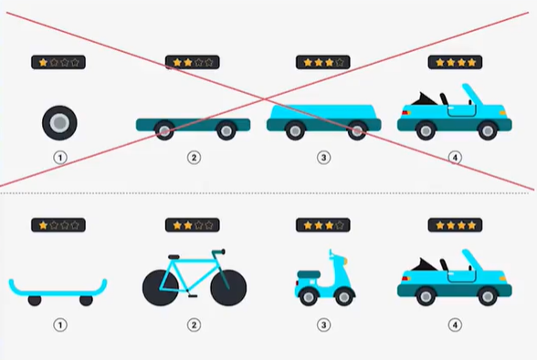
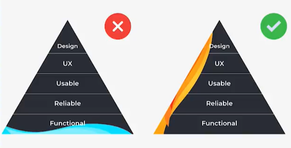
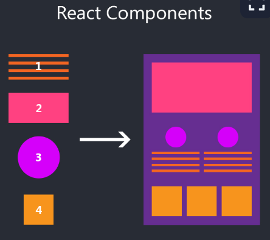

# Lección 1: REACT

* Cómo aprender React.js
* Cuándo usar React.js
* Componentes
* Comportamiento
* Introduccion al Proyecto del Curso
* ¿que podrá hacer nuestra aplicacion web con REACT?
* Propuesta de diseño
* Componentes y comportamientos de nuestra 

## Cómo aprender React.js

Un desarrollador Frontend, es el encargado de darle al usuario una experiencia limpia y amigable. Para esto debe dominar artes sagradas como lo son HTML, CSS y JavaScript, principalmente JavaScript.

Para lograr una buena carta de presentación de nuestra aplicación web tenemos a React.js quien es una de las herramientas más poderosas que tenemos actualmente para poder manipular tanto CCS como HTML desde JavaScript.

React.js nos permite trabajar de una manera rápida y limpia, sí, pero para poder usarlo y explotar todo su poder, debemos tener conocimientos previos. React.js no es una puerta de entrada al mundo de Frontend, más bien es esa manera de coronar todo un camino de logros y aprendizajes.

Te recomendamos empezar con el mundo de React.js cuando ya tenes conocimientos de HTML, CSS, DOM, maquetación, asincronismos y conocimientos básicos de lo que es un Framework y de las librerías de JavaScript.

Un buen desarrollador web no utiliza nada más librerías, o nada más Frameworks. Sabe buscar el equilibrio perfecto para poder crear esa experiencia que encante al usuario y le brinde una experiencia rápida, elegante e intuitiva. Para llegar a este nivel, debemos tener bien entendidos los diferentes paradigmas, herramientas y conceptos de los Frameworks y las librerías de JavaScript.

Bienvenido a esta nueva aventura con React.js, que tu camino sea fortificante y tus conocimientos recompensados.

## Cuándo usar React.js

Si quieres saber cuando usar React.js y cuando no, lo primero que necesitas es conocer bien que tipo de proyecto estás desarrollando. Solamente conociendo los alcances actuales y los futuros podrás tener un panorama completo de las necesidades que vas a cubrir y cuáles son las funciones básicas que debe tener para ser un MVP.

Hay dos flujos de trabajo para crear aplicaciones web.

Modelo en cascada:

Cuando cada equipo tiene un tiempo para hacer todo su respectivo trabajo para construir una app. Por ejemplo: el equipo de diseño diseña la aplicación, el de desarrollo programa todo lo diseñado y finalmente se lanza la app recogiendo el feedback de los usuarios y se vuelve a empezar tomando en cuenta lo dicho por los usuarios. Es problemático porque el esfuerzo puede ser en vano porque no se tiene un feedback hasta que se termina de construir la app.

Modelo del ciclo MVP iterativo

Se refiere a que cada equipo se enfocará en ciclos pequeños para construir partes más pequeñas de una app que en conjunto se puedan ir ensamblando para hacer la app completa. Resuelve el problema del modelo anterior, aquí se recibe el feedback al terminar cada pequeño ciclo, recibiendo así el feedback de manera más inmediata que antes.

MVPs o :

Se refiere a construir funcionalidades pequeñas que sean completas para que podamos lanzarla y medir su impacto y decidir si seguir ese camino o probar otra cosa.

Hay que escoger el problema más crucial que debe resolver la app.

## Componentes

 Son la forma de estructurar las piezas de nuestra página web para hacerlas escalables, nos ahorran tiempo y esfuerzo. Son abstracciones de los elementos de nuestra página web para ser reusados las veces que necesitemos. Trabajan de manera independiente a los demás. Con React.js todos los componentes tienen una conexión con el resto de componentes de la app para que en conjunto reaccionen a los comportamientos del usuario.

## Comportamiento: 

Las interacciones de los usuarios.

React es muy bueno cuando queremos construir rápidamente la primera versión funcional de una app web sin sacrificar su escalabilidad. Si no queremos escalarla después, no usar React.js, podemos usar JS simple

