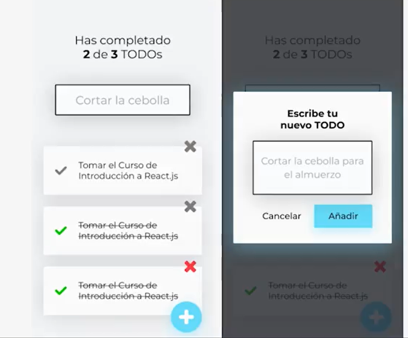
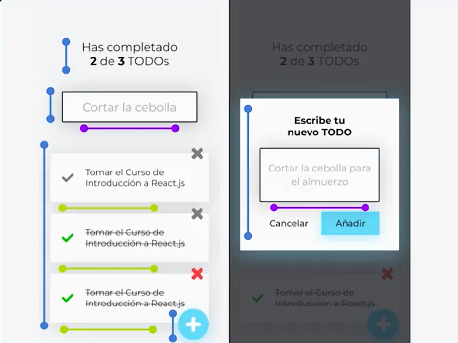
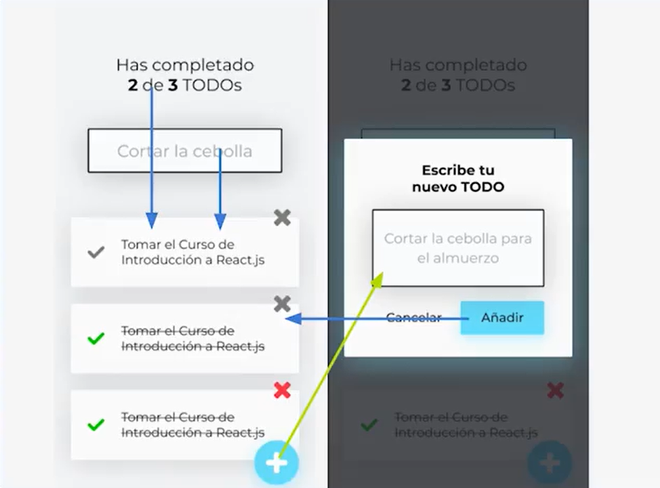

# Lección 2 : REACT - Introduccion al Proyecto del Curso

* Introduccion al Proyecto del Curso
* ¿que podrá hacer nuestra aplicacion web con REACT?
* Propuesta de diseño
* Componentes y comportamientos de nuestra APP

## Introduccion al Proyecto del Curso

Vamos a analizar los componentes y comportamientos de este curso.

Estudiaremos lo fundamental, nuestro proyecto lo trabajaremos con el modelo MVP e iremos expandiendo y conociendo mas herramientas, no iremos creando una partecita de una aplicaciones , sino que crearemos una aplicacion pequeña pero completa, esta aplicacion irá creciendo y tendrá nuevas funcionalidades

Nuestra app será una Lista de Tareas

## ¿que podrá hacer nuestra aplicacion web con REACT?

Crearemos lista de tareas (TODO´s).
Ver las tareas que hemos creado.
Buscar y filtrar las tareas que creamos.
Marcar como completadas las tareas.
Contar cuantas tareas no hemos completado.
Borrar Tareas

Estas son la funcionalidades Base que vamos a trabajar en esta primera parte.

## Propuesta de diseño

Buscador de tareas.
Texto que nos dice cuantas tareas hemos completado del total.
lista de tareas.
Cada tarea Tiene un texto
Boton para marcar como completada una tarea.
Boton para borrar una tarea
Si hacemos una busqueda solo tienen que aparecer las tareas que cumplan con la condicion de la busqueda.
Boton para agregar nuevas tareas (Modal) con formulario para crear nuevas tareas.

## Componentes y comportamientos de nuestra 

Componentes:

El buscador es un componente, el texto del buscador es otro componente, la lista de tareas es otro componente, pero esta lista de tareas está compuesta de tareas que son !otros componentes ! : ); se pueden repetir las veces que las personas agreguen mas tareas.
No imnportan cuantas tareas tengamos el mismo componente va a ser el mismo para todos.

Tambien tenemos el modal que es un componente que tiene un formulario para agregar tareas.

Al final vamos a reutilizar componentes entre toda la app.

Comportamientos:

El buscador de tareas debe poder filtrar que Tareas aparecen o no en la lista dependiendo lo que busquen las personas.

El contador debe cambiar dependiendo lo que pase en la lista, (la cantidad que agreguemos, que marquemos como completados y que borremos).

Todas estas acciones afectan a la lista, sino que lo que hagamos afecta al resto de componentes.

El modal con el formulario tambien afecta a la lista.

Todos componentes, asi sean partes fisicamente diferentes se tienen que comunicar entre ellas para responder a las acciones de las personas que utilicen la app

